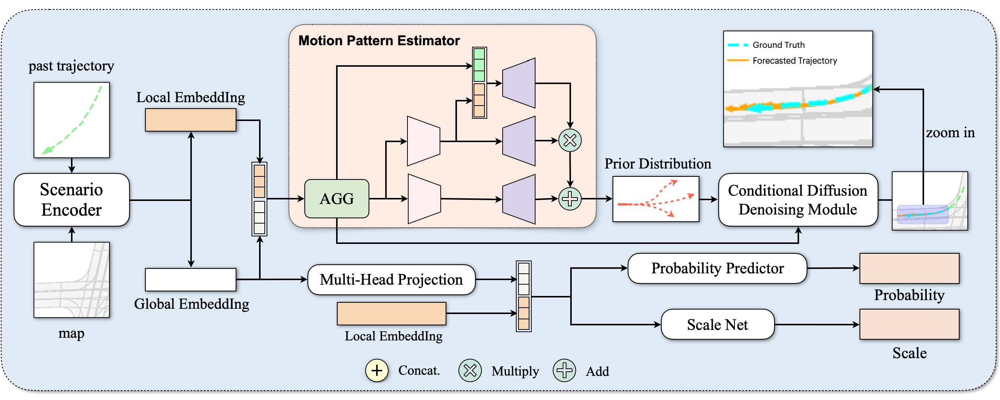

<div align="center">
<!-- <h1>ADM </h1> -->
<h3>ADM: Accelerated Diffusion Model via Estimated Priors for Robust Motion Prediction under Uncertainties</h3>


## Introduction
We will release our code after accepting by ITSC 2024.
<div align="left">


Trajectory prediction is a challenging problem in autonomous driving as it demands the system to comprehend stochastic dynamics and the multi-modal nature of real-world agent interactions. Diffusion models have recently risen to prominence, and have proven particularly effective in pedestrian trajectory prediction tasks. However, the significant time consumption and sensitivity to noise have limited the real-time predictive capability of diffusion models. In response to these impediments, we propose a novel diffusion-based, acceleratable framework that adeptly predicts future trajectories of agents with enhanced resistance to noise. The core idea of our model is to learn a coarse-grained prior distribution of trajectory, which can skip a large number of denoise steps. This advancement not only boosts sampling efficiency but also maintains the fidelity of prediction accuracy. Our method meets the rigorous real-time operational standards essential for autonomous vehicles, enabling prompt trajectory generation that is vital for secure and efficient navigation. Through extensive experiments, our method speeds up the inference time to 136ms compared to standard diffusion model, and achieves 15.27% FDE improvement in multi-agent motion prediction on the Argoverse 1 motion forecasting dataset.


## Citation
If you find ADM is useful in your research or applications, please consider giving us a star 🌟 and citing it by the following BibTeX entry.
```bibtex
@article{zhang2023online,
  title={Online Map Vectorization for Autonomous Driving: A Rasterization Perspective},
  author={Zhang, Gongjie and Lin, Jiahao and Wu, Shuang and Song, Yilin and Luo, Zhipeng and Xue, Yang and Lu, Shijian and Wang, Zuoguan},
  journal={arXiv preprint arXiv:2306.10502},
  year={2023}
}
```
